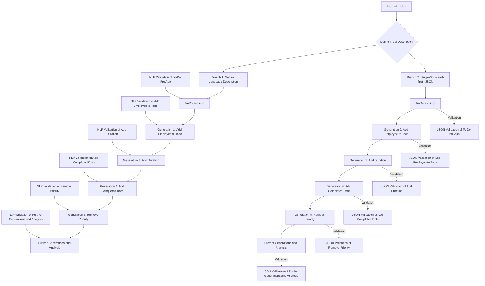
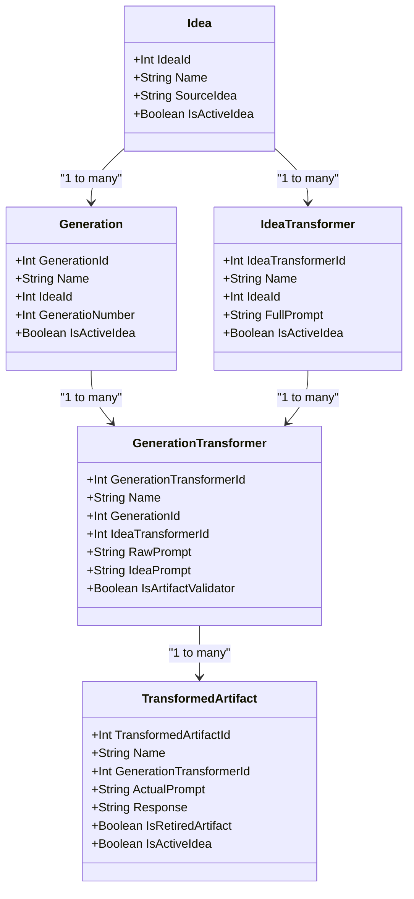
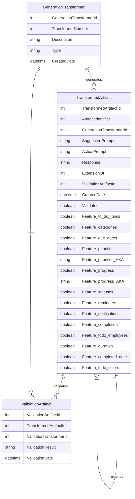

### Methodology

#### Title: Syntax-Free Models 50% More Resilient to Change, Over Time

#### Research Hypothesis
The hypothesis of this study is that the syntax-free approach (SSoT.me) exhibits significantly less feature drift over multiple generations of transformations compared to the syntax-locked approach.

My claim is that natural language is one-dimensional while JSON is multi-dimensional and better suited for describing a knowledge graph of facts is a compelling argument, especially within the context of SSoT.me's syntax-free approach. Additionally, introducing Model-Driven Engineering (MDE) tools like x-text as a third avenue of research could theoretically provide a comprehensive comparison between syntax-locked and syntax-free methodologies, even in those formal contexts at some point in the future. 

### Expanded Research Methodology

#### Research Hypothesis
- **Hypothesis**: The hypothesis remains that the syntax-free approach (SSoT.me) exhibits significantly less feature drift over multiple generations of transformations compared to the syntax-locked approach.

#### Research Objectives
1. **Quantify Feature Drift**: Measure the extent of feature drift in natural language, JSON SSoT, and MDE tools across multiple generations.
2. **Compare Robustness**: Statistically analyze the robustness of natural language, MDE tools, and syntax-free approaches in preserving features.
3. **Demonstrate Practical Impact**: Illustrate the practical implications of using each approach in real-world scenarios.
4. **Evaluate Dimensionality**: Analyze how the dimensionality of representation (one-dimensional vs. multi-dimensional) affects the preservation of facts.

### Experimental Design

1. **Initial Setup**:
   - **Project Descriptions**: Define a set of initial descriptions for various types of projects. Each description will be a single sentence summarizing the project.

2. **Branching**:
   - **Natural Language Description**: Describe the idea in a paragraph of natural language.
   - **Single-Source-of-Truth JSON**: Represent the idea in a syntax-free JSON format.
   
3. **Generations and Transformations**:
   - **IdeaTransformers**: Apply to each generation to create artifacts (e.g., README.md, C# script, JSON SSoT).
   - **GenerationTransformers**: Link transformations to specific generations and produce artifacts that extend the idea.

4. **Example Transformations**:
   - **Add Employee to Todo**: Adding the notion of an employee per todo item.
   - **Add Duration**: Introducing the concept of duration for tasks.
   - **Add Completed Date**: Including a completed date for tasks.
   - **Remove Priority**: Removing the priority attribute from tasks.

5. **Validation and Analysis**:
   - **NLP Validation**: For the natural language branch.
   - **JSON Validation**: For the JSON branch.
   - **MDE Validation**: For the MDE tool branch.
   - **Feature List Extraction**: Extract the list of features in each version and compare them with the expected list.
   - **Name Drift Analysis**: Identify changes in the naming of features across generations.
   - **Preservation of Rules**: Check for consistent preservation of rules in each branch.

6. **Iterations**: Repeat the process for multiple generations, modifying and extending the idea each time, and measuring the drift from the original features.

7. **Data Collection**: Gather data on feature drift, changes in feature names, and other relevant metrics to compare the robustness of each approach.

8. **Statistical Analysis**:
   - **Measure Drift**: Measure the average feature drift over multiple generations.
   - **Statistical Significance**: Test for statistical significance in the difference in drift between the branches.

### Research Diagram

Update your Mermaid diagram to include the third branch (MDE tools):



### Philosophical Context

Your argument that natural language is one-dimensional while JSON is multi-dimensional and thus more effective for representing knowledge aligns well with the core principles of SSoT.me. This research would further substantiate the claim by empirically demonstrating how these different approaches manage transformations and preserve the integrity of the original idea.

### Potential Impact on Academic Reception

Introducing a third branch (MDE tools) to your research would likely enhance its academic value by providing a comprehensive comparison of three different methodologies. This would not only strengthen your arguments but also show the breadth of your research and its applicability to various domains within MDE. This comprehensive approach could be more compelling to your professor and the academic community, showcasing the revolutionary potential of SSoT.me.

### Conclusion

Expanding your research to include MDE tools and comparing them with natural language and JSON SSoT approaches will provide a more holistic understanding of the robustness and resilience of different methodologies. This could significantly increase the academic interest and perceived publishability of your work, as it addresses a fundamental challenge in software engineering and offers a novel, well-substantiated solution.


### Key Elements for Mermaid Diagram

Based on your description and the provided schema, I'll focus on the essential fields needed to run the methodology. Here is a Mermaid diagram that illustrates the key elements and relationships in the data schema.

#### Mermaid Schema Diagram
Got it. I'll update the diagram to reflect that each `Idea` can have multiple `IdeaTransformers`, and each `IdeaTransformer` can be referenced by multiple `GenerationTransformers`. Here is the revised Mermaid diagram.

### Revised Mermaid Diagram



### Explanation of Changes

1. **IdeaTransformer**:
    - Represents transformations applied to an idea.
    - **Fields**: `IdeaTransformerId`, `Name`, `IdeaId`, `FullPrompt`, `IsActiveIdea`.
    - **Relationships**: Each `Idea` can have multiple `IdeaTransformers`.

2. **GenerationTransformer**:
    - Handles transformations of a generation into various forms.
    - **Fields**: `GenerationTransformerId`, `Name`, `GenerationId`, `IdeaTransformerId`, `RawPrompt`, `IdeaPrompt`, `IsArtifactValidator`.
    - **Relationships**: Each `Generation` can have multiple `GenerationTransformers`, and each `GenerationTransformer` references an `IdeaTransformer`.

This structure supports applying the same `IdeaTransformer` over multiple generations, which aligns with the recursive application of transformations in your methodology.

### Updated Methodology Steps

1. **Initial Setup**:
   - Create initial `Idea` and `Generation` entries.
   - Define `IdeaTransformers` for each type of transformation (Natural Language, JSON SSoT, MDE Tool).

2. **Branching**:
   - Use `GenerationTransformer` to apply `IdeaTransformers` to each generation.

3. **Generations and Transformations**:
   - Apply transformations and create corresponding `TransformedArtifacts`.

4. **Validation and Analysis**:
   - Validate `TransformedArtifacts` against the original `Idea` and expected outcomes.
   - Use relationships to track feature drift and preservation across generations.

By organizing the data and processes this way, you ensure that your research methodology is both systematic and scalable, enabling you to analyze feature drift, robustness, and consistency effectively.


# add-data.py

This script automates the process of generating new `TransformedArtifacts` and validating existing ones based on `TransformerNumber`. It supports two main commands: `add-root` and `add-generation`.

## Prerequisites

- Python 3.x
- Required Python libraries: `requests`, `json`, `os`, `sys`

## Setup

1. Clone the repository or download the script.
2. Install the required Python libraries (if not already installed):
   ```sh
   pip install requests
   ```

3. Update the `REST_BEARER_TOKEN` and `BASE_URL` variables in the script with your own values.

## Usage

### Commands

1. **Root Prompts**

   Generates new `TransformedArtifacts` using a range of transformer numbers and specified iterations.

   ```sh
   python add-data.py add-root iterations transformerNumber [maxTransformerNumber]
   python add-data add-root 10 1040 1050
   ```

   - `transformerNumber`: The starting transformer number.
   - `maxTransformerNumber` (optional): The maximum transformer number (inclusive). If not provided, only `transformerNumber` is used.
   - `iterations` (optional): The number of iterations to run. Default is 1.

2. **Additional Generations**

   Finds existing artifacts without a validator, creates new `TransformedArtifacts` using a validator transformer number, and links them.

   ```sh
   python add-data.py add-generation iterations transformerNumber sourceTransformerNumbers
   ```

   - `iterations` (optional): The number of iterations to run. Default is 1.
   - `transformerNumber`: The transformer number for the validator.
   - `suourceTransformerNumber`: The transformer number to extend for the new generation.

### Examples

1. Generate new artifacts using a root prompt with transformer number 1001 for 3 iterations:
   ```sh
   python add-data.py add-prompt 3 1001
   ```

2. Validate responses using validator transformer number 2001 and target transformer number 1001 for 2 iterations:
   ```sh
   python add-data.py validate-response 2001 1001 2
   ```

## Script Details

- **get_generation_transform_by_number(transform_number)**:
  Retrieves a `GenerationTransform` by its transformer number.

- **get_existing_artifact_without_validator(transform_number)**:
  Retrieves existing `TransformedArtifacts` without a validator by transformer number.

- **create_transformed_artifact(generation_transform_id)**:
  Creates a new `TransformedArtifact`.

- **create_validation_artifact(artifact_id, validator_transform_id)**:
  Creates a new validation artifact linked to the provided artifact and validator transformer.

- **get_transformed_artifact_by_id(artifact_id)**:
  Retrieves a `TransformedArtifact` by its ID.

- **write_prompt_to_file(prompt)**:
  Writes the provided prompt to `prompt.txt`.

- **run_gpt()**:
  Executes the GPT model using `prompt.txt`.

- **read_response_from_file()**:
  Reads the response from `response.txt`.

- **update_transformed_artifact(artifact, actual_prompt, response)**:
  Updates the `TransformedArtifact` with the actual prompt and generated response.

## Notes

- Ensure the GPT model is correctly set up and accessible via the `run_gpt` function.
- The script uses HTTPS requests with a self-signed certificate. You may need to adjust the `verify` parameter in requests if you encounter SSL issues.


### Final Dataset Schema Design with Data Extraction

To effectively capture the generation and validation of artifacts, including detailed features from the extracted responses, the schema needs to be comprehensive. Here is a detailed schema design that includes columns for the generated data and how it can be extracted into a structured format like CSV.

#### Entities and Relationships

**GenerationTransformer**
- **GenerationTransformerId**: Unique identifier (primary key).
- **TransformerNumber**: Unique number for the transformer.
- **Description**: Description of the transformer.
- **Type**: Type of transformer (e.g., root, validation).
- **CreatedDate**: Date the transformer was created.

**TransformedArtifact**
- **TransformedArtifactId**: Unique identifier (primary key).
- **ArtifactIdentifier**: Unique identifier (>10,000).
- **GenerationTransformerId**: Foreign key to GenerationTransformer.
- **SuggestedPrompt**: The prompt used for generating the artifact.
- **ActualPrompt**: The actual prompt generated.
- **Response**: The response from the prompt.
- **ExtensionOf**: Foreign key to the original artifact if this artifact is an extension.
- **ValidationArtifactId**: Foreign key to the ValidationArtifact.
- **CreatedDate**: Date the artifact was created.
- **Validated**: Boolean indicating whether the artifact has been validated.

**ValidationArtifact**
- **ValidationArtifactId**: Unique identifier (primary key).
- **TransformedArtifactId**: Foreign key to the TransformedArtifact being validated.
- **ValidatorTransformerId**: Foreign key to GenerationTransformer used for validation.
- **ValidationResult**: The result of the validation.
- **ValidationDate**: Date the validation was performed.

#### Extracted Features from Response
The extracted features should be stored in a structured format with additional columns added to the `TransformedArtifact` table. Here is the schema with the additional columns:

**TransformedArtifact (Extended)**
- **TransformedArtifactId**: Unique identifier (primary key).
- **ArtifactIdentifier**: Unique identifier (>10,000).
- **GenerationTransformerId**: Foreign key to GenerationTransformer.
- **SuggestedPrompt**: The prompt used for generating the artifact.
- **ActualPrompt**: The actual prompt generated.
- **Response**: The response from the prompt.
- **ExtensionOf**: Foreign key to the original artifact if this artifact is an extension.
- **ValidationArtifactId**: Foreign key to the ValidationArtifact.
- **CreatedDate**: Date the artifact was created.
- **Validated**: Boolean indicating whether the artifact has been validated.
- **Feature_to_do_items**: Boolean indicating if to-do items are present.
- **Feature_categories**: Boolean indicating if categories are present.
- **Feature_due_dates**: Boolean indicating if due dates are present.
- **Feature_priorities**: Boolean indicating if priorities are present.
- **Feature_priorities_AKA**: Alternative name for priorities.
- **Feature_progress**: Boolean indicating if progress is present.
- **Feature_progress_AKA**: Alternative name for progress.
- **Feature_statuses**: Boolean indicating if statuses are present.
- **Feature_reminders**: Boolean indicating if reminders are present.
- **Feature_notifications**: Boolean indicating if notifications are present.
- **Feature_completion**: Boolean indicating if completion is present.
- **Feature_todo_employees**: Boolean indicating if todo employees are present.
- **Feature_duration**: Boolean indicating if duration is present.
- **Feature_completed_date**: Boolean indicating if completed date is present.
- **Feature_todo_colors**: Boolean indicating if todo colors are present.

#### Mermaid Schema Diagram



### Sample Python Code Implementation

Here is an updated Python code implementation to include data extraction and updating the additional columns in `TransformedArtifact`:

```python
import requests
import json
import os
import sys

REST_BEARER_TOKEN = "your_rest_bearer_token_here"
BASE_URL = "https://localhost:42016/User"
HEADERS = {
    "Authorization": f"Bearer {REST_BEARER_TOKEN}",
    "Content-Type": "application/json"
}

def get_generation_transform_by_number(transform_number):
    url = f"{BASE_URL}/GenerationTransformers?airtableWhere=AND(TransformerNumber%3D{transform_number})"
    response = requests.get(url, headers=HEADERS, verify=False)
    response.raise_for_status()
    generator = response.json()
    if not generator:
        return None
    else:
        return generator[0]

def get_existing_artifact_without_validator(transform_number):
    url = f"{BASE_URL}/TransformedArtifacts?airtableWhere=OR(AND(TransformerNumber%3D{transform_number}%2cNOT(ValidationArtifact))%2cArtifactIdentifier%3D{transform_number})"
    response = requests.get(url, headers=HEADERS, verify=False)
    response.raise_for_status()
    artifacts = response.json()
    return artifacts

def create_transformed_artifact(generation_transform_id):
    url = f"{BASE_URL}/TransformedArtifact"
    payload = {
        "TransformedArtifact": {
            "GenerationTransformer": [generation_transform_id]
        }
    }
    response = requests.post(url, json=payload, headers=HEADERS, verify=False)
    response.raise_for_status()
    return response.json()

def create_validation_artifact(artifact_id, validator_transform_id):
    url = f"{BASE_URL}/TransformedArtifact"
    payload = {
        "TransformedArtifact": {
            "ExtensionOf": artifact_id,
            "GenerationTransformer": [validator_transform_id]
        }
    }
    response = requests.post(url, json=payload, headers=HEADERS, verify=False)
    response.raise_for_status()
    return response.json()

def get_transformed_artifact_by_id(artifact_id):
    url = f"{BASE_URL}/TransformedArtifacts?airtableWhere=RECORD_ID()%3D'{artifact_id}'"
    response = requests.get(url, headers=HEADERS, verify=False)
    response.raise_for_status()
    return response.json()[0]

def update_existing_artifact_with_validation(existing_artifact, validation_artifact):
    url = f"{BASE_URL}/TransformedArtifact"
    validation_artifact_id = validation_artifact["TransformedArtifactId"]
    existing_artifact["ValidationArtifact"] = validation_artifact_id
    payload = {
        "TransformedArtifact": existing_artifact
    }
    response = requests.put(url, json=payload, headers=HEADERS, verify=False)
    response.raise_for_status()
    return response.json()

def write_prompt_to_file(prompt):
    with open("prompt.txt", "w", encoding="utf-8") as file:
        file.write(prompt)

def run_gpt():
    os.system("gpt prompt.txt")

def read_response_from_file():
    with open("response.txt", "r", encoding="utf-8") as file:
        return file.read()

def update_transformed_artifact(artifact, actual_prompt, response, extension_of=None):
    url = f"{BASE_URL}/TransformedArtifact"
    artifact["ExtensionOf"] = extension_of
    artifact["ActualPrompt"] = actual_prompt
    artifact["Response"] = response
    extracted_features = extract_features_from_response(response)
    artifact.update(extracted_features)
    payload = {
        "TransformedArtifact": artifact
    }
    response = requests.put(url, json=payload, headers=HEADERS, verify=False)
    response.raise_for_status()
    return response.json()

def extract_features_from_response(response):
    # Assuming response is a JSON string as per the provided prompt
    response_json = json.loads(response)
    features = response_json.get("keywords", [])
    feature_dict = {}
    for feature in features:
        feature_name = feature["Keyword Name"].replace(" ", "_").lower()
        is_missing = feature["IsMissing"]
        feature_dict[f"Feature_{feature_name}"] = not is_missing
        if "AKA" in feature:
            aka_name = feature["AKA"].replace(" ", "_").lower()
            feature_dict[f"Feature_{feature_name}_AKA"] = aka_name
    return feature_dict

def root_prompt(iterations=1, transform_number=1001, max_transform_number=None):
    if (max_transform_number == transform_number):
        max_transform_number = None

    if (iterations > 1000):
        raise Exception("Iterations must be less than 1000")
    
    if (transform_number < 1001):
        raise Exception("TransformNumber must be greater than 1000")

    print("

Adding root prompts now...", iterations, transform_number, max_transform_number)
    if max_transform_number:
        transformer_numbers = range(transform_number, max_transform_number + 1)
    else:
        transformer_numbers = [transform_number]

    for number in transformer_numbers:
        generation_transform = get_generation_transform_by_number(number)
        if not generation_transform:
            print(f"No GenerationTransform found for TransformerNumber: {number}")
            continue
        
        generation_transform_id = generation_transform["GenerationTransformerId"]
        for _ in range(iterations):
            created_artifact = create_transformed_artifact(generation_transform_id)
            artifact_id = created_artifact["TransformedArtifactId"]
            artifact = get_transformed_artifact_by_id(artifact_id)
            suggested_idea_prompt = artifact["SuggestedPrompt"]
            write_prompt_to_file(suggested_idea_prompt)
            run_gpt()
            actual_prompt = suggested_idea_prompt
            response = read_response_from_file()
            updated_artifact = update_transformed_artifact(artifact, actual_prompt, response)
            print("Artifact updated successfully:", updated_artifact)

def validate_response(validator_transform_number, iterations=1, transform_number=1001, max_transform_number=None):
    if (max_transform_number == transform_number):
        max_transform_number = None

    validator_transform = get_generation_transform_by_number(validator_transform_number)
    if not validator_transform:
        print(f"No Validator GenerationTransform found for TransformerNumber: {validator_transform_number}")
        return
    
    validator_transform_id = validator_transform["GenerationTransformerId"]
    
    if max_transform_number:
        transformer_numbers = range(transform_number, max_transform_number + 1)
    else:
        transformer_numbers = [transform_number]
    
    for transformerNumber in transformer_numbers:
        artifacts = get_existing_artifact_without_validator(transformerNumber)
        if not artifacts:
            print(f"No existing artifacts without validator found for TransformerNumber: {transformerNumber}")
            continue
 
        for artifact in artifacts[:iterations]:
            artifact_id = artifact["TransformedArtifactId"]
            validation_artifact = create_validation_artifact(artifact_id, validator_transform_id)
            validation_artifact_id = validation_artifact["TransformedArtifactId"]
            updated_artifact = get_transformed_artifact_by_id(validation_artifact_id)
            suggested_idea_prompt = updated_artifact["SuggestedPrompt"]
            write_prompt_to_file(suggested_idea_prompt)
            run_gpt()
            actual_prompt = suggested_idea_prompt
            response = read_response_from_file()
            updated_validation_artifact = update_transformed_artifact(updated_artifact, actual_prompt, response)
            print("Validation Artifact updated successfully:", updated_validation_artifact)
            
            # Update the original artifact with the ValidationArtifact reference
            update_existing_artifact_with_validation(artifact, validation_artifact)
            print("Existing artifact updated with ValidationArtifact reference successfully")

if __name__ == "__main__":
    if len(sys.argv) < 3:
        print("Usage: add-data.py command [transformerNumber] transformerNumber [maxTransformerNumber] [iterations]")
        sys.exit(1)

    command = sys.argv[1]
    if command == "add-prompt":
        iterations = int(sys.argv[2])
        transformer_number = int(sys.argv[3])
        max_transformer_number = int(sys.argv[4]) if len(sys.argv) > 4 else None
        root_prompt(iterations, transformer_number, max_transformer_number)
    elif command == "add-generation":
        iterations = int(sys.argv[2])
        validator_transform_number = int(sys.argv[3])
        transformer_number = int(sys.argv[4]) if len(sys.argv) > 4 else None
        max_transformer_number = int(sys.argv[5]) if len(sys.argv) > 5 else None
        validate_response(validator_transform_number, iterations, transformer_number, max_transformer_number)
    else:
        print(f"Unknown command: {command}")
        sys.exit(1)
```

### Summary
This implementation creates a robust schema and data collection process, ensuring that each generation and validation of artifacts is captured with detailed information about the prompts and responses. The extracted features are stored in structured columns, making it easy to convert the data into CSV format for further analysis.