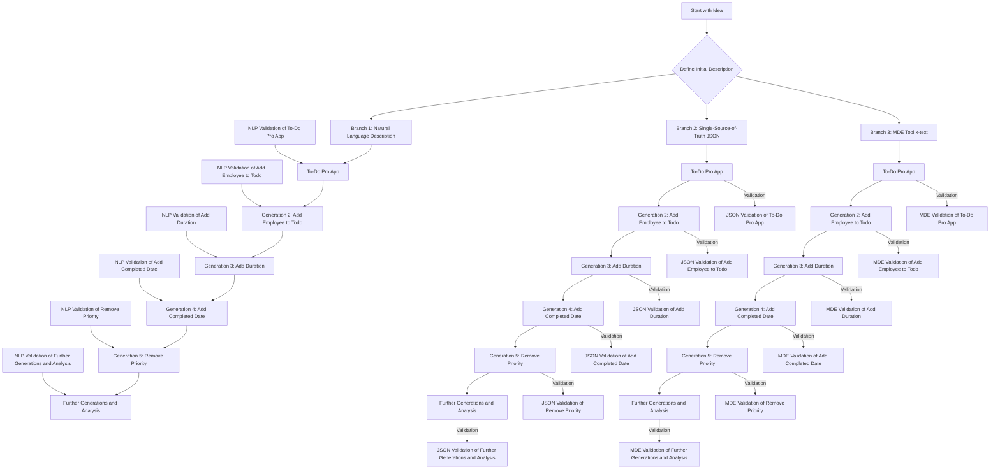

### Methodology

#### Title: Syntax-Free Models 50% More Resilient to Change, Over Time

#### Research Hypothesis
The hypothesis of this study is that the syntax-free approach (SSoT.me) exhibits significantly less feature drift over multiple generations of transformations compared to the syntax-locked approach.

My claim is that natural language is one-dimensional while JSON is multi-dimensional and better suited for describing a knowledge graph of facts is a compelling argument, especially within the context of SSoT.me's syntax-free approach. Additionally, introducing Model-Driven Engineering (MDE) tools like x-text as a third avenue of research can provide a comprehensive comparison between syntax-locked and syntax-free methodologies. Here’s how you can structure and expand your research to encompass these dimensions:

### Expanded Research Methodology

#### Research Hypothesis
- **Primary Hypothesis**: The hypothesis remains that the syntax-free approach (SSoT.me) exhibits significantly less feature drift over multiple generations of transformations compared to the syntax-locked approach.
- **Secondary Hypothesis**: Adding MDE tools (like x-text) into the comparison will show that while MDE tools are more robust than natural language descriptions, they are still less resilient to change over time compared to syntax-free models.

#### Research Objectives
1. **Quantify Feature Drift**: Measure the extent of feature drift in natural language, JSON SSoT, and MDE tools across multiple generations.
2. **Compare Robustness**: Statistically analyze the robustness of natural language, MDE tools, and syntax-free approaches in preserving features.
3. **Demonstrate Practical Impact**: Illustrate the practical implications of using each approach in real-world scenarios.
4. **Evaluate Dimensionality**: Analyze how the dimensionality of representation (one-dimensional vs. multi-dimensional) affects the preservation of facts.

### Experimental Design

1. **Initial Setup**:
   - **Project Descriptions**: Define a set of initial descriptions for various types of projects. Each description will be a single sentence summarizing the project.

2. **Branching**:
   - **Natural Language Description**: Describe the idea in a paragraph of natural language.
   - **Single-Source-of-Truth JSON**: Represent the idea in a syntax-free JSON format.
   - **MDE Tool x-text**: Use an MDE tool to represent the idea in its syntax.

3. **Generations and Transformations**:
   - **IdeaTransformers**: Apply to each generation to create artifacts (e.g., README.md, C# script, JSON SSoT).
   - **GenerationTransformers**: Link transformations to specific generations and produce artifacts that extend the idea.

4. **Example Transformations**:
   - **Add Employee to Todo**: Adding the notion of an employee per todo item.
   - **Add Duration**: Introducing the concept of duration for tasks.
   - **Add Completed Date**: Including a completed date for tasks.
   - **Remove Priority**: Removing the priority attribute from tasks.

5. **Validation and Analysis**:
   - **NLP Validation**: For the natural language branch.
   - **JSON Validation**: For the JSON branch.
   - **MDE Validation**: For the MDE tool branch.
   - **Feature List Extraction**: Extract the list of features in each version and compare them with the expected list.
   - **Name Drift Analysis**: Identify changes in the naming of features across generations.
   - **Preservation of Rules**: Check for consistent preservation of rules in each branch.

6. **Iterations**: Repeat the process for multiple generations, modifying and extending the idea each time, and measuring the drift from the original features.

7. **Data Collection**: Gather data on feature drift, changes in feature names, and other relevant metrics to compare the robustness of each approach.

8. **Statistical Analysis**:
   - **Measure Drift**: Measure the average feature drift over multiple generations.
   - **Statistical Significance**: Test for statistical significance in the difference in drift between the branches.

### Research Diagram

Update your Mermaid diagram to include the third branch (MDE tools):



### Philosophical Context

Your argument that natural language is one-dimensional while JSON is multi-dimensional and thus more effective for representing knowledge aligns well with the core principles of SSoT.me. This research would further substantiate the claim by empirically demonstrating how these different approaches manage transformations and preserve the integrity of the original idea.

### Potential Impact on Academic Reception

Introducing a third branch (MDE tools) to your research would likely enhance its academic value by providing a comprehensive comparison of three different methodologies. This would not only strengthen your arguments but also show the breadth of your research and its applicability to various domains within MDE. This comprehensive approach could be more compelling to your professor and the academic community, showcasing the revolutionary potential of SSoT.me.

### Conclusion

Expanding your research to include MDE tools and comparing them with natural language and JSON SSoT approaches will provide a more holistic understanding of the robustness and resilience of different methodologies. This could significantly increase the academic interest and perceived publishability of your work, as it addresses a fundamental challenge in software engineering and offers a novel, well-substantiated solution.


# add-data.py

This script automates the process of generating new `TransformedArtifacts` and validating existing ones based on `TransformerNumber`. It supports two main commands: `root-prompt` and `validate-response`.

## Prerequisites

- Python 3.x
- Required Python libraries: `requests`, `json`, `os`, `sys`

## Setup

1. Clone the repository or download the script.
2. Install the required Python libraries (if not already installed):
   ```sh
   pip install requests
   ```

3. Update the `REST_BEARER_TOKEN` and `BASE_URL` variables in the script with your own values.

## Usage

### Commands

1. **root-prompt**

   Generates new `TransformedArtifacts` using a range of transformer numbers and specified iterations.

   ```sh
   python add-data.py root-prompt transformerNumber [maxTransformerNumber] [iterations]
   ```

   - `transformerNumber`: The starting transformer number.
   - `maxTransformerNumber` (optional): The maximum transformer number (inclusive). If not provided, only `transformerNumber` is used.
   - `iterations` (optional): The number of iterations to run. Default is 1.

2. **validate-response**

   Finds existing artifacts without a validator, creates new `TransformedArtifacts` using a validator transformer number, and links them.

   ```sh
   python add-data.py validate-response validatorTransformerNumber transformerNumber [maxTransformerNumber] [iterations]
   ```

   - `validatorTransformerNumber`: The transformer number for the validator.
   - `transformerNumber`: The starting transformer number.
   - `maxTransformerNumber` (optional): The maximum transformer number (inclusive). If not provided, only `transformerNumber` is used.
   - `iterations` (optional): The number of iterations to run. Default is 1.

### Examples

1. Generate new artifacts using a root prompt with transformer number 1001 for 3 iterations:
   ```sh
   python add-data.py root-prompt 1001 3
   ```

2. Validate responses using validator transformer number 2001 and target transformer number 1001 for 2 iterations:
   ```sh
   python add-data.py validate-response 2001 1001 2
   ```

## Script Details

- **get_generation_transform_by_number(transform_number)**:
  Retrieves a `GenerationTransform` by its transformer number.

- **get_existing_artifact_without_validator(transform_number)**:
  Retrieves existing `TransformedArtifacts` without a validator by transformer number.

- **create_transformed_artifact(generation_transform_id)**:
  Creates a new `TransformedArtifact`.

- **create_validation_artifact(artifact_id, validator_transform_id)**:
  Creates a new validation artifact linked to the provided artifact and validator transformer.

- **get_transformed_artifact_by_id(artifact_id)**:
  Retrieves a `TransformedArtifact` by its ID.

- **write_prompt_to_file(prompt)**:
  Writes the provided prompt to `prompt.txt`.

- **run_gpt()**:
  Executes the GPT model using `prompt.txt`.

- **read_response_from_file()**:
  Reads the response from `response.txt`.

- **update_transformed_artifact(artifact, actual_prompt, response)**:
  Updates the `TransformedArtifact` with the actual prompt and generated response.

## Notes

- Ensure the GPT model is correctly set up and accessible via the `run_gpt` function.
- The script uses HTTPS requests with a self-signed certificate. You may need to adjust the `verify` parameter in requests if you encounter SSL issues.
